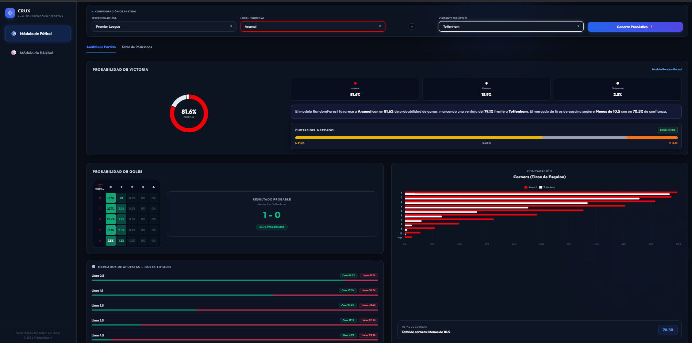
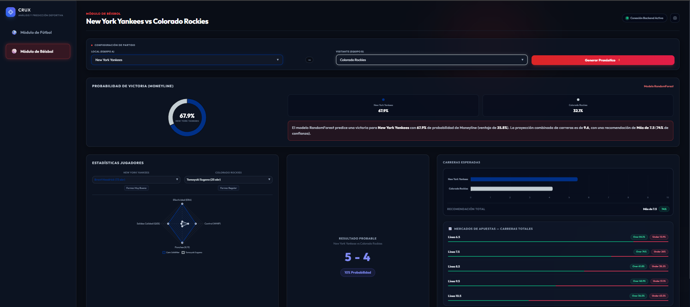
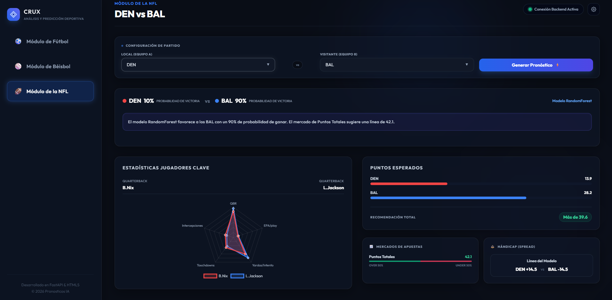

#  CRUX | Motor Predictivo Deportivo (Fútbol y Béisbol)

Una plataforma web *End-to-End* diseñada para la ingesta, análisis y predicción de resultados deportivos utilizando Machine Learning y probabilidad matemática. 

El sistema evalúa el rendimiento histórico de equipos de la MLB y las principales ligas de fútbol mundial para calcular probabilidades de victoria, líneas de Over/Under y sugerencias para apuestas combinadas.

##  Características Principales

* **Modelos Probabilísticos:** Implementación de la Distribución de Poisson y algoritmos de clasificación (Random Forest) para predecir marcadores exactos, tiros de esquina y carreras totales.
* **Automatización ETL:** Scripts en Python integrados con **Football-data (csv)** y **MLB Stats** para la actualización diaria y automática de la base de datos (SQLite).
* **Interfaz Glassmorphism:** Dashboard moderno y responsivo construido en HTML/CSS nativo con TailwindCSS, optimizado para una lectura rápida de métricas de rendimiento.

## 📊 Visualización de Pronósticos

A continuación, se muestra cómo se visualiza el análisis y las probabilidades generadas por nuestros modelos directamente en la plataforma web:

### Fútbol


### Béisbol


### NFL


## 📡 APIs y Fuentes de Datos

El sistema integra información de múltiples fuentes para garantizar la cobertura y precisión de los análisis:

| Deporte | Fuente | Uso |
| :--- | :--- | :--- |
| **Fútbol** | [Football-data (csv)](https://football-data.co.uk/) | Resultados en vivo, estadísticas de partidos, rendimiento de equipos y ligas. |
| **Béisbol (MLB)** | [MLB Stats (API Pública)](https://statsapi.mlb.com/) | Estadísticas avanzadas de jugadores y equipos de la Major League Baseball. |
| **NFL** | [nfl-data-py](https://github.com/pdarkin/nfl-data-py) | Resultados en vivo, estadísticas de jugadores y equipos de la National Football League. |


## 🛠️ Stack Tecnológico

**Backend & Data Science:**
* Python 3.x
* FastAPI & Uvicorn (Servidor Web y API REST)
* Pandas & Scikit-learn (Procesamiento y Machine Learning)
* SQLite (Base de datos relacional)

**Frontend:**
* Vanilla JavaScript (Fetch API, LocalStorage)
* HTML5 & CSS3 (Tailwind CSS, Chart.js)

## Instalación y Uso Local

1. Clona este repositorio:
   ```bash
   git clone [https://github.com/MarcoDeVicente/Analisis-y-Pronosticos-Deportivos.git](https://github.com/MarcoDeVicente/Analisis-y-Pronosticos-Deportivos.git)
